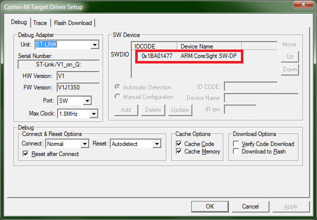

# Типичные ошибки Кейла и как их исправить

Большая часть ошибок одинакова и может порождаться различными ситуациями. Но кое-какую диагностику все же можно провести.

Если вы наткнулись на ошибку, которой нет в этом списке, или предложенное лечение не помогает - зовите/пишите преподавателю.

Если пишете письмо и хотите приложить скриншот ошибки - используйте инструмент "Ножницы", не кидайте скриншот всех своих мониторов т_т

## Error: Flash Download failed  -  Target DLL has been cancelled

Эта ошибка сама по себе говорит буквально "Не шмогла", загрузка не удалась. Как правило, вылезает после какой-нибудь другой, более информативной ошибки.

Скриншот этой ошибки кидать бесполезно и гуглить ее тоже бесполезно.

## Error: Flash Download failed  -  Could not load file блаблабла.axf'

Эта ошибка означает, что нет файла, который вы пытаетесь загрузить в плату или запустить на симуляторе. Почему нет файла? Потому что вы ни разу не компилировали проект (или он ни разу не скомпилировался). Или он перестал компилироваться.
Сделайте Project->Clean target, а потом Rebuild.

## No ST-LINK detected

Ну тут ошибка говорит сама за себя - не найден ST-Link, т.е. отладчик на плате. Либо плата не подключена к компьютеру, либо сломана или в процессе поломки (замкнута земля и питание, например).

## No ULINK2/ME Device found

Не найден отладчик ULINK2. Неудивительно, что он не найден, ведь мы им и не пользуемся. Значит, в проекте выбран не тот отладчик. Зайдите в *Options->Debug* и в выпадающем списке справа выберите ST-Link.  
Затем зайдите на вкладку Utilities и поставьте галку *Use debug driver*

## No target connected

Отладчик подключен, но прошиваемый процессор не найден. Этому может быть множество причин:
 * Выбран неправильный интерфейс отладки (JTAG вместо SW). Зайдите в *Options->Debug->ST-Link Debugger (Settings)* и в выпадающем списке *Port* выберите *SW*. Убедитесь, что при этом в окошке справа появляется нечто аналогичное:



 * Процессор не запитан, выпала перемычка JP1 на плате.
 * Процессор умер, помянем.

## Error: Flash Download failed  -  "Cortex-M3"

Эта ошибка означает, что само прошивание не получилось. Посмотрите в окно *Build Output*, чтобы увидеть подробности, например:

`No Algorithm found for: 08000000H - 08000453H`

Не выбран алгоритм прошивания. Зайдите на вкладку *Options->Debug->ST-Link Debugger (Settings)->Flash download* и выберите нужный алгоритм, нажав на *Add*. Для STM32F103 нужно выбрать STM32F10x Med-density Flash

## Cannot Load Flash Programming Algorithm !

Эта ошибка появляется, если прошивание началось, а потом прервалось некорректно. Посмотрите в окно *Build Output*, чтобы увидеть подробности, например:

```
Cannot Write to RAM for Flash Algorithms !
Verify Failed!
Error: Flash Download failed  -  "Cortex-M3"
```

Процессор выключился или некорректно ответил на прошивание. Либо с него пропало питание, пока вы его прошивали, либо в линии SWD есть какие-то помехи. Позовите преподавателя :)
