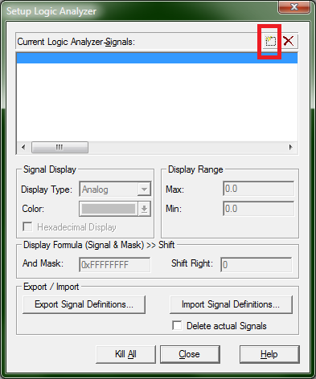
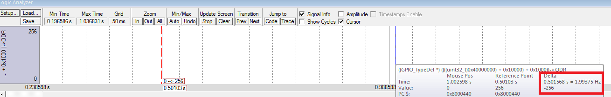

# Как использовать виртуальный осциллограф

Виртуальный осциллограф всегда работает в симуляторе, но не всегда поддерживается аппаратным отладчиком; в частности, не поддерживается нашими платами STM32 VL Discovery.

При этом, если вы заходите в отладку на плате, все переменные из осциллографа пропадают. Это грустно, но что с этим делать я не знаю, разве что экспортировать сигналы, а потом импортировать их обратно. Если выясните - обязательно расскажите.

Виртуальный осциллограф может показывать **только** значения переменных **со статическим временем жизни** - т.е. глобальных переменных, статических переменных и регистров периферии. При этом статическую переменную можно добавить только остановив отладку внутри ее области видимости.

# Как открыть осциллограф

Зайдите в отладку, выберите View -> Analysis window -> Logic analyzer.

# Как добавить новый сигнал в анализатор

Есть несколько способов.

- Кликните по переменной (если добавляете регистр - лучше выделите  его целиком, например GPIOC->ODR нужно добавлять целиком, а не только ODR) правой кнопкой и выберите Add to -> Logic analyzer. Примечание: если сделать это, не открыв предварительно сам осциллограф, то значение добавится, но его не будет видно, пока вы не закроете и не откроете осциллограф заново.
- В осциллографе нажмите Setup, в новом окне нажмите вот эту кнопку и впишите имя переменной.

# Что можно настроить

В меню Setup вы можете выбрать следующие настройки:
- Тип сигнала. Он может быть 
    - Analog - сигнал принимает любые значения, которые может принимать переменная конкретного типа
    - Bit - все, что не ноль, будет отображаться как 1, а ноль - как ноль.
    - State - непонятная хрень.
- Цвет.
- Фиксированный диапазон значений (по вертикали); в дальнейшем можно кликнуть на сигнал и выбрать "Adaptive min/max", чтобы диапазон подбирался сам.
- And mask и right shift, чтобы вырезать определенные биты из сигнала по формуле: `(signal & mask) >> shift`

В основном окне вы можете:
- Зумить с помощью колеса мыши.
- Кликнуть на имя сигнала слева и с помощью клавиш "стрелка вправо" и "стрелка влево" перемещать курсор между фронтами сигнала.
- Установить галочки Signal info и Cursor, чтобы измерять время между двумя точками на графике. Для этого вам нужно кликом установить курсор на первую точку и навести мышь на вторую точку. При этом во всплывающем окне будет выведено значение Delta (интервал времени) и обратная ей величина (частота). При этом необходимо помнить, что точность измерения зависит от точности установки курсоров, она будет тем выше, чем меньше масштаб.

# Подвохи

1) Даже симулятор не симулирует все идеально, некоторые регистры, которые должны менять свое значение в реальности, на симуляторе не меняются.
1) Иногда регистр *не хочет* добавляться в осциллограф и выкидывает окошечко "Can't add xxxx to Logic Analyzer". Точную причину этого выяснить не удалось, но есть обходные манёвры. 
    1) Нужно останавливать отладку, когда вы добавляете новый сигнал.
    2) Если вы не можете добавить регистр GPIOA->ODR или GPIOA->IDR, попробуйте добавить виртуальный регистр PORTA (ну, или PORTB, PORTC и т.д.)
    3) Всегда можно завести глобальную переменную и в цикле приравнивать ей регистр. А уже переменную добавить в осциллограф.